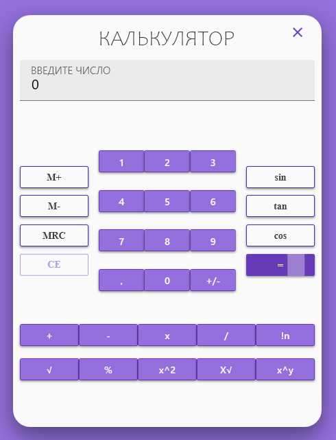

# calculator_WPF

**There is a calculator with:**
 - *One operand operations (!n, √, x^2)*
 - *Two operand operations (+, -, /, x, %, X√, x^y)*
 - *Trigonometry operations (sin, tan, cos)*
 - *Memory options (M+, M-, MRC)*
 - *Equality/cleaning (=, CE)*

*The app was built by using interface, to define a default implementation for members. (IOperations)
And then all calculator operations are fully implemented in class. (Operations)*

**Features:**
- *to remember numbers person works with - there is doubledScreen under the mainScreen:
it writes the whole expression step by step.*
- *one operand operations also can be used as "=", if you write down your request "1+1" and insted of clicking
on "=" you click on operation you used.*
- *memory operations aren't available during another one - available only for operands or result of operations.*
- *for interface design was used Material Design in XAML, installed by NuGet.*
